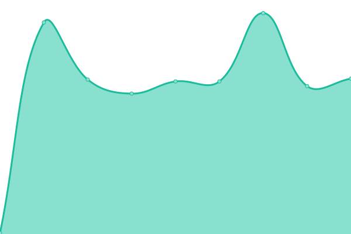

# [📈 Live Status](https://demo.upptime.js.org): <!--live status--> **🟧 Partial outage**

This repository contains the open-source uptime monitor and status page for [Upptime](https://upptime.js.org), powered by [Upptime](https://github.com/upptime/upptime).

With [Upptime](https://upptime.js.org), you can get your own unlimited and free uptime monitor and status page, powered entirely by a GitHub repository. We use [Issues](https://github.com/upptime/upptime/issues) as incident reports, [Actions](https://github.com/zenith110/uptime/actions) as uptime monitors, and [Pages](https://demo.upptime.js.org) for the status page.

<!--start: status pages-->
<!-- This summary is generated by Upptime (https://github.com/upptime/upptime) -->
<!-- Do not edit this manually, your changes will be overwritten -->
<!-- prettier-ignore -->
| URL | Status | History | Response Time | Uptime |
| --- | ------ | ------- | ------------- | ------ |
|  [Portfolio Frontend](https://www.abrahannevarez.dev) | 🟩 Up | [portfolio-frontend.yml](https://github.com/zenith110/uptime/commits/HEAD/history/portfolio-frontend.yml) | 

 163ms
     
 | 

<a href="https://status.abrahannevarez.dev/history/portfolio-frontend">100.00%</a>
    

|  [Portfolio Graphql](https://graphql.abrahannevarez.dev) | 🟩 Up | [portfolio-graphql.yml](https://github.com/zenith110/uptime/commits/HEAD/history/portfolio-graphql.yml) | 

 204ms
     
 | 

<a href="https://status.abrahannevarez.dev/history/portfolio-graphql">100.00%</a>
    

|  [Pubsub Frontend](https://www.pubsub-api.dev/) | 🟥 Down | [pubsub-frontend.yml](https://github.com/zenith110/uptime/commits/HEAD/history/pubsub-frontend.yml) | 

 256ms
     
 | 

<a href="https://status.abrahannevarez.dev/history/pubsub-frontend">57.21%</a>
    

|  [Pubsub Api](https://api.pubsub-api.dev/apidocs/) | 🟥 Down | [pubsub-api.yml](https://github.com/zenith110/uptime/commits/HEAD/history/pubsub-api.yml) | 

 255ms
     
 | 

<a href="https://status.abrahannevarez.dev/history/pubsub-api">57.21%</a>
    

|  [Pubsub Graphql](https://graphql.pubsub-api.dev/) | 🟥 Down | [pubsub-graphql.yml](https://github.com/zenith110/uptime/commits/HEAD/history/pubsub-graphql.yml) | 

 264ms
     
 | 

<a href="https://status.abrahannevarez.dev/history/pubsub-graphql">57.21%</a>
    

|  [Admin Panel](https://admin.abrahannevarez.dev/) | 🟩 Up | [admin-panel.yml](https://github.com/zenith110/uptime/commits/HEAD/history/admin-panel.yml) | 

 130ms
     
 | 

<a href="https://status.abrahannevarez.dev/history/admin-panel">100.00%</a>
    

<!--end: status pages-->

[**Visit our status website →**](https://demo.upptime.js.org)

## 📄 License

- Powered by: [Upptime](https://github.com/upptime/upptime)
- Code: [MIT](./LICENSE) © [Upptime](https://upptime.js.org)
- Data in the `./history` directory: [Open Database License](https://opendatacommons.org/licenses/odbl/1-0/)
